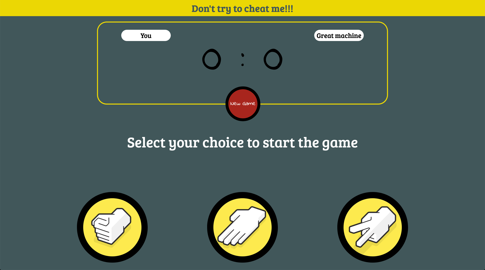

# rock-paper-scissors game

### Amazing game to play mitical rock-paper-scissors with computer

Just press the rock, paper or scissors image to select your choice. You could see the result in the screen message.

First to get five points wins!

If you want to restart the game, just press "New Game" button.

Enjoy and don't try to cheat the system (it is imposible :^|)



## Starting the app

### Install dependencies
```npm install```

### Start the server
```npm run app:serve```

By default, it starts the server in http://localhost:8090. If the port is busy, it will start in the next free port.

If you want to start the app in another port, launch the command
```npm run app:serve -- -p <PORT>```

### Access the app

Assuming the servers is started in port 8080, just navigate to http://localhost:8080/index


